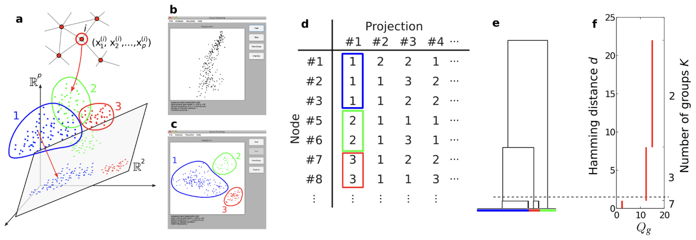
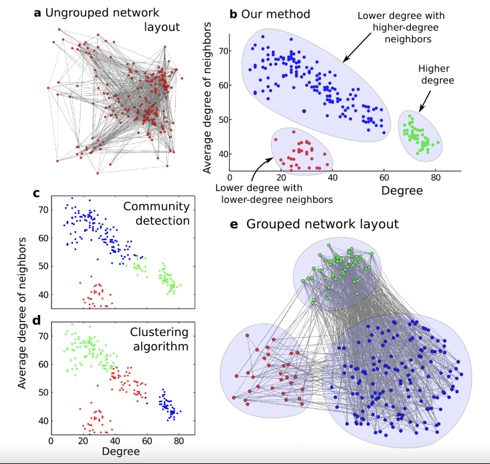

# Clustering Algorithm based on Projection and Visual Analytics Approach

In this project, I developed a new clustering algorithm that combines the visual pattern recognition ability of humans with the power of automated processing. The figure below illustrates the algorithm:

1. _p_ features are computed for each node in a given network of _n_ nodes (panel __a__). The nodes are then represented as points in the _p_-dimensional feature space, which are projected onto a randomly chosen two-dimensional subspace.

2. Using a graphical interface (see a [video demo of my MATLAB implementation](https://youtu.be/F0hLdxc1nR8) and [code](find_struct_groups)), the user can either reject the projection (panel __b__), which indicates that there is no visible group separation, or indicate visible groups (panel __c__), which automatically assigns a group index to each node for that particular projection.

3. Repeating this for a given number of random projections, each node is associated with a group assignment vector listing the group indices the user has assigned to that node (panel __d__).

4. Dendrogram obtained by clustering the assignment vectors (panel __e__). Cutting the dendrogram at a threshold Hamming distance produces a grouping for the network.

5. Quality of grouping as a function of the threshold level (panel __f__). The appropriate number of groups is determined to be 3, with thresholding at the "elbow" (dashed line).

For more details, see my journal publication: [T. Nishikawa and A. E. Motter, *Discovering Network Structure Beyond Communities*, Scientific Reports **1**, 151 (2011)](https://doi.org/10.1038/srep00151)
