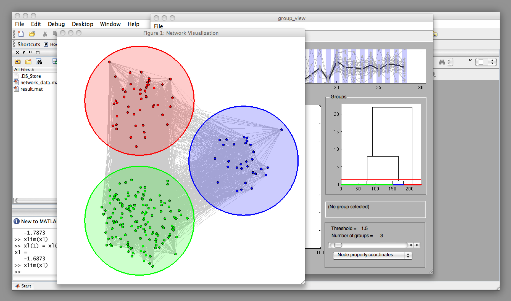

# Visual Analytics Software for Discovering Structural Groups in Complex Networks

Copyright (C) 2011  Takashi Nishikawa

## What the software does

This software allows you to choose from a set of networks and apply the method of finding structural groups, which is described in the publication titled,  *Discovering Network Structure Beyond Communities* [[Scientific Reports **1**, 151 (2011)](https://doi.org/10.1038/srep00151)].

Original sources for the data for the available networks can be found in "Copyright.txt".  More detailed description can be found in the above referenced paper.

If you are interested in applying the method to your own network dataset, please contact me for a version of the software with full functionality.

## How to run the software

Extract all files from the downloaded zip file.  This should create a directory named "find_struct_groups".  To run the software from within Matlab, just change the current directory to this directory and type `find_struct_groups`. If you prefer to run it from a different directory, you can simply move the whole directory to anywhere you wish; just make sure to include the directory in the Matlab search path.

## Troubleshooting

If the software stops with the error "Undefined function or method 'clustering_coefficients_mex' for...", the version of the MatlabBGL toolbox included in this software may not be suitable for your computer.  Please visit 

http://www.mathworks.com/matlabcentral/fileexchange/10922

and try downloading and installing an appropriate version.  The newly installed directory "matlab_bgl" should replace the one with the same name in the directory "find_struct_groups".
